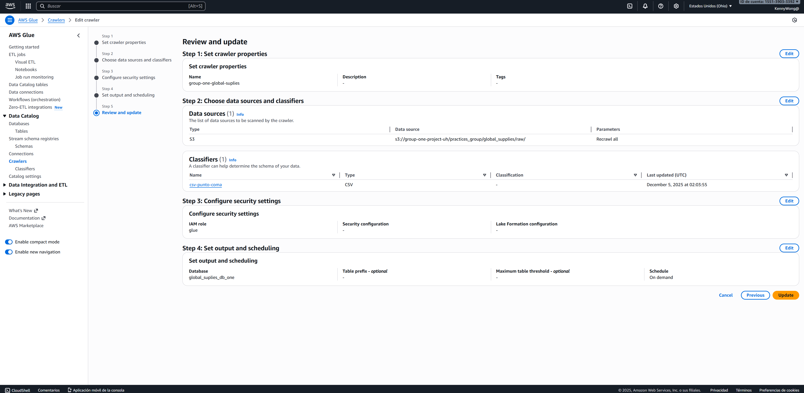
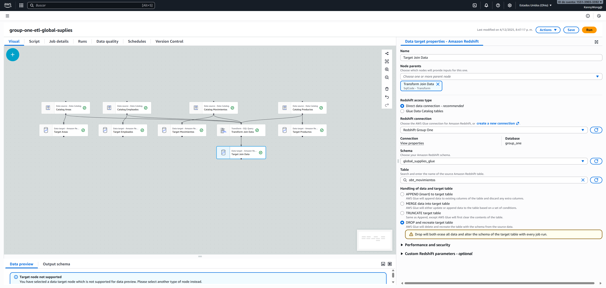
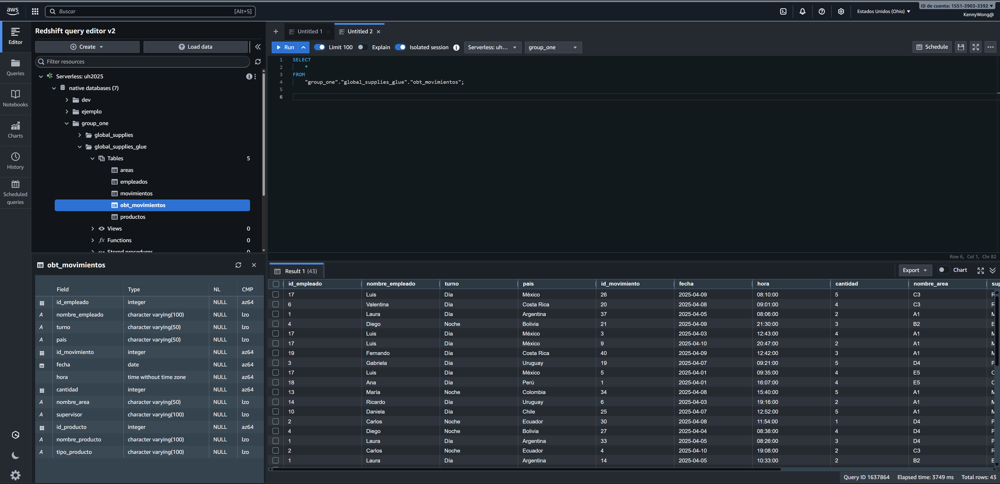
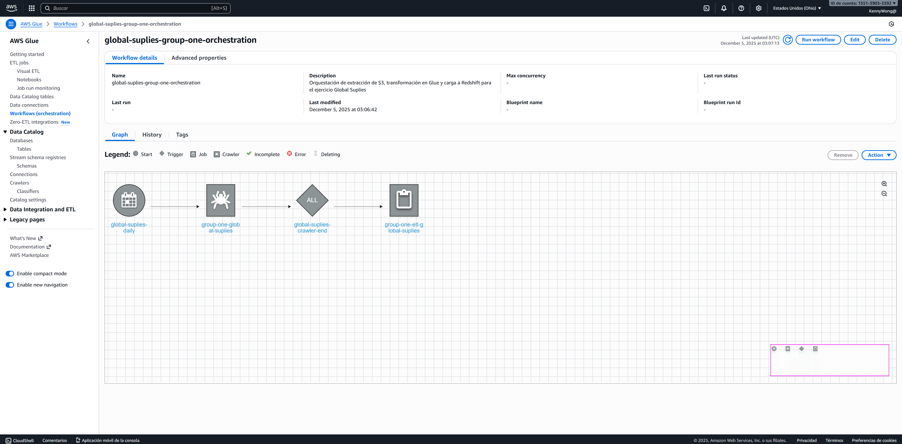

# Método: Extracción desde Redshft (Copy)

## DDL Tablas
DDL de las tablas en la que insertaremos la información utilizando **COPY** from *csv* desde **S3**

### Areas
```sql
CREATE TABLE global_supplies.areas (
    area VARCHAR(50) NOT NULL, 
    supervisor VARCHAR(100),
    PRIMARY KEY (area)
);
```

### Empleados
```sql
CREATE TABLE global_supplies.empleados (
    id_empleado INT NOT NULL,
    nombre VARCHAR(100),
    turno VARCHAR(50),
    pais VARCHAR(50),
    PRIMARY KEY (id_empleado)
);
```

### Productos
```sql
CREATE TABLE global_supplies.productos (
    id_producto INT NOT NULL,
    nombre_producto VARCHAR(100),
    tipo_producto VARCHAR(100),
    PRIMARY KEY (id_producto)
);
```

### Movimientos
```sql
CREATE TABLE global_supplies.movimientos (
    id_movimiento INT NOT NULL,
    id_empleado INT,
    id_producto INT,
    fecha DATE,
    hora TIME,
    cantidad INT,
    area VARCHAR(50),
    PRIMARY KEY (id_movimiento),
    FOREIGN KEY (id_empleado) REFERENCES global_supplies.empleados(id_empleado),
    FOREIGN KEY (id_producto) REFERENCES global_supplies.productos(id_producto),
    FOREIGN KEY (area) REFERENCES global_supplies.areas(area)
);
```

## Ingesta de Datos
Insertaremos los datos directos de **S3** con **COPY**

### Areas
```sql
COPY global_supplies.areas 
FROM 's3://group-one-project-uh/practices_group/global_supplies/raw/areas.csv' 
IAM_ROLE 'arn:aws:iam::155139033392:role/redshiftuh' 
FORMAT AS CSV 
DELIMITER ';' 
QUOTE '"' 
IGNOREHEADER 1
REGION AS 'us-east-2';
```

### Empleados
```sql
COPY global_supplies.empleados 
FROM 's3://group-one-project-uh/practices_group/global_supplies/raw/empleados.csv' 
IAM_ROLE 'arn:aws:iam::155139033392:role/redshiftuh' 
FORMAT AS CSV 
DELIMITER ';' 
QUOTE '"' 
IGNOREHEADER 1
REGION AS 'us-east-2';
```

### Productos
```sql
COPY global_supplies.productos 
FROM 's3://group-one-project-uh/practices_group/global_supplies/raw/productos.csv' 
IAM_ROLE 'arn:aws:iam::155139033392:role/redshiftuh' 
FORMAT AS CSV 
DELIMITER ';' 
QUOTE '"' 
IGNOREHEADER 1
REGION AS 'us-east-2';
```

### Movimientos
```sql
COPY global_supplies.movimientos 
FROM 's3://group-one-project-uh/practices_group/global_supplies/raw/movimientos.csv' 
IAM_ROLE 'arn:aws:iam::155139033392:role/redshiftuh' 
FORMAT AS CSV 
DELIMITER ';' 
QUOTE '"' 
IGNOREHEADER 1
REGION AS 'us-east-2';
```

# Método: Glue (ETL)
Este segundo método nos entrega el mismo resultado que el primero solo que utilizamos **Glue Catalog** para orquestar el *ETL*, esto con fines didacticos ya que el 
volumen de datos es mínimo para el escenario.

## Creación de Catálogo (Crawlers)
Creamos un **Crawler** que catalogue los cuatro *.csv* en **Glue Catalog**



## Desarrollo de ETL (Visual ETL)
Una vez ya definidos los catálogos con los que vamos a trabajar desarrollamos el **Visual ETL**, para poner en práctica distintas funciones que ofrece la herramienta
creamos un *EL* simple para cada tabla y ademas un *ETL* donde hacemos un **JOIN** de toda la información y lo depositamos a una *"obt"*.



## Ingesta de Data (Redshift)
Tenemos primeramente que recrear las tablas en **Redshift** en un nuevo *schema* esto para mantener productivo el caso anterior en el que aprendimos el uso del **COPY** directo desde **Redshift**,
para ello, simplemente ejecutaremos las querys DDL del inicio solo que cambiamos el *schema*, aparte creamos la tabla que almacenará la trasnformación que configuraremos en **AWS Glue**:

```sql
CREATE TABLE "group_one"."global_supplies_glue"."obt_movimientos" AS
SELECT
    E.id_empleado,
    E.nombre AS nombre_empleado,
    E.turno,
    E.pais,
    M.id_movimiento,
    M.fecha,
    M.hora,
    M.cantidad,
    A.area AS nombre_area,
    A.supervisor,
    P.id_producto,
    P.nombre_producto,
    P.tipo_producto
FROM
    "group_one"."global_supplies_glue"."movimientos" M
RIGHT JOIN  
    "group_one"."global_supplies_glue"."empleados" E
    ON M.id_empleado = E.id_empleado
LEFT JOIN  
    "group_one"."global_supplies_glue"."areas" A
    ON M.area = A.area
LEFT JOIN  
    "group_one"."global_supplies_glue"."productos" P
    ON M.id_producto = P.id_producto
```

Verificamos la data en Redshift:


## Orquestación de Pipeline
Finalmente, para simular un ambiente productivo en el cual existe todo un proceso automatizado vamos a incluir nuestro **Crawler** y **Visual ETL** en una 
*orquestación* que ejecute periodicamente este **ETL** de datos.



# Consultas Requeridas
Consultas solicitadas en el requerimiento del entregable de clase

1 ¿Qué empleado tiene más movimientos 
registrados? 
```sql
SELECT
    id_empleado,
    COUNT(1) AS cantidad_movimientos
FROM
    "group_one"."global_supplies"."movimientos"
GROUP BY 1
ORDER BY 2 DESC
```

2 ¿Qué producto fue movido más veces? 
```sql
SELECT 
    id_producto, 
    COUNT(1) AS total_movido
FROM "group_one"."global_supplies"."movimientos"
GROUP BY 1
ORDER BY 2 DESC
```

3 ¿En qué día se registraron más 
movimientos?
```sql
SELECT 
    CAST(fecha AS DATE) AS dia, 
    COUNT(1) AS total
FROM "group_one"."global_supplies"."movimientos"
GROUP BY 1
ORDER BY 2 DESC
```

4 ¿Qué área tuvo la mayor cantidad total 
movida?
```sql
SELECT 
    area, 
    SUM(cantidad) AS total_movido
FROM FROM "group_one"."global_supplies"."movimientos"
GROUP BY 1
ORDER BY 2 DESC
```

5 ¿Qué turno tiene más empleados?
```sql
SELECT 
    turno, 
    COUNT(id_empleado) AS cantidad
FROM "group_one"."global_supplies"."empleados" 
GROUP BY 1
ORDER BY 2 DESC
LIMIT 1
```

6 ¿Qué país tiene más empleados? 
```sql
SELECT 
    pais, 
    COUNT(id_empleado) AS cantidad
FROM "group_one"."global_supplies"."empleados" 
GROUP BY 1
ORDER BY 2 DESC
LIMIT 1
```

7 ¿Qué tipo de producto es más frecuente 
en inventario?
```sql
SELECT
    tipo_producto,
    COUNT(1) AS total_productos
FROM  "group_one"."global_supplies"."productos"
GROUP BY 1
ORDER BY 2 DESC
LIMIT 1
```

8 ¿Qué supervisor tiene más áreas 
asignadas?
```sql
SELECT
    supervisor,
    COUNT(area) AS total_areas_asignadas
FROM "group_one"."global_supplies"."areas" 
GROUP BY 1
ORDER BY 2 DESC
LIMIT 1
```

9 ¿Qué empleados han movido más de 
10 productos en total?
```sql
SELECT 
    id_empleado, 
    SUM(cantidad) AS total_movido
FROM "group_one"."global_supplies"."movimientos"
GROUP BY 1
HAVING SUM(cantidad) > 10
ORDER BY 2 DESC
```

10 ¿Qué hora tuvo más movimientos 
registrados? 
```sql
SELECT
    DATEPART(HOUR, hora) AS hora_del_dia,
    COUNT(1) AS total_movimientos
FROM "group_one"."global_supplies"."movimientos"
GROUP BY 1
ORDER BY 2 DESC
```