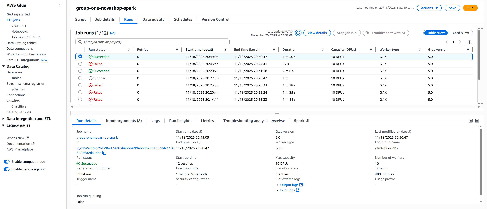
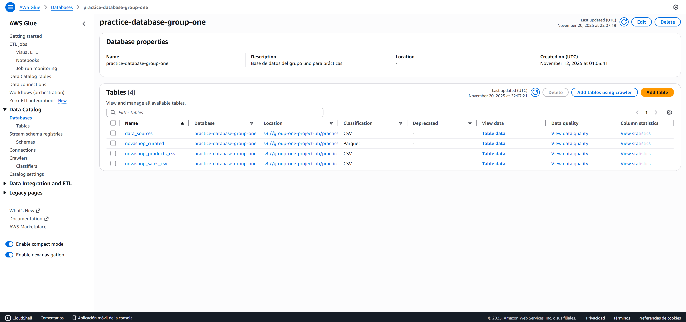

# Ejercicio Novashop
Objetivo: Usar un Crawler de AWS Glue para catalogar dos archivos CSV (productos y ventas), crear un Job de ETL (PySpark) que 
genere una sola tabla en formato Parquet y consultar con Athena para responder 10 preguntas de analítica.


## Pasos seguidos

### Creación de Crawlers

Utilizando la consola de Glue, creamos un **crawler** llamado *group-one-novashop* que cataloga la estructura de los *-csv*
dentro del **URI:***s3://group-one-project-uh/practices_group/Novashop/*

### Consultas de prueba

Realizamos las siguientes consultas de prueba, ninguna brindó resultados, por lo que programamos un Job (Visual ETL) para la ingesta de datos a los catálogos.

```sql
    SELECT * FROM "practice-database-group-one"."novashop_products_csv" limit 10;
```

```sql
    SELECT * FROM "practice-database-group-one"."novashop_sales_csv" limit 10;
```

### Ingesta a tablas originales (Job Visual)

Creamos un Job, utilizanod la consola visual para extraer de **S3** e insertar en la tabla de **Glue Data Catalog**, el Job creado se llama *group-one-novashop*

Una vez creado el Job y concluido ahora si vemos datos en las tablas y creamos el siguiente Join:

```sql
    SELECT
        A.*,
        B.*
    FROM "practice-database-group-one"."novashop_sales_csv" AS A
    LEFT JOIN "practice-database-group-one"."novashop_products_csv" AS B
    ON A.product_id = B.product_id
```

# Entendiendo Spark

Investigando como funciona Spark, vimos que en **AWS Clue Studio** la función de crear un **ETL** utilizando **Spark** con el *Script editor*.

Una vez abierto, nos muestra esta estructura:

```python
    import sys
    from awsglue.transforms import *
    from awsglue.utils import getResolvedOptions
    from pyspark.context import SparkContext
    from awsglue.context import GlueContext
    from awsglue.job import Job

    ## @params: [JOB_NAME]
    args = getResolvedOptions(sys.argv, ['JOB_NAME'])

    sc = SparkContext()
    glueContext = GlueContext(sc)
    spark = glueContext.spark_session
    job = Job(glueContext)
    job.init(args['JOB_NAME'], args)


    ## Para que Glue procese correctamente el código 
    ## una buena práctica es siempre colocar todo el ETL
    ## entre el job.init() y el job.commit()
    job.commit()
```

Esto es una versión enriquecida de pySpark iuntegrada en Glue, una de las anotaciones mas importantes es el comentario que colocamos dentro del segmento de código anterior, *Para que Glue procese correctamente el código una buena práctica es siempre colocar todo el ETL entre el job.init() y el job.commit()*

El código de Spark completo con la extracción de los CSV se almacena entre los adjuntos en el repositorio, las transformaciones (JOINs y Métricas calculadas) y el sink de data curada en formato *.parquet*

Aquí la evidencia de las pruebas y errores que estuvimos ejecutando y haciendo ajustes entendiendo el código:



# Entregable - Capturas de Generales

Una vez ya ejecutado el pySpark, repetimos el proceso de crear un Crawler en la ruta donde se encuentran nuestros *.parquet*, en este caso no hubo inconvenientes y automaticmaente se cargaron los datos en el catálogo y pudimos efectuar las consultas requeridas para la práctica utilizando **AWS Athena**


Ademas, se adjunta captura de la base de datos donde se observan las tablas originales y la unión creada:



1) Ventas totales y margen bruto (suma de total y de profit) del periodo


2) Ticket promedio (promedio de total por orden)


3) Top 5 categorías por ventas.


4) Tendencia mensual de ventas y margen


5) Ciudades con mejor rendimiento por ventas


6) Marca con mayor contribución a la utilidad


7) Método de pago: distribución de ventas y conteo de órdenes


8) Canal (Tienda vs Online): comparación de ventas, utilidad y ticket promedio


9) Clientes únicos y tasa de recompra (clientes con más de 1 orden)


10) Descuento total aplicado y su efecto en el margen (profit/ventas por nivel de
descuento)