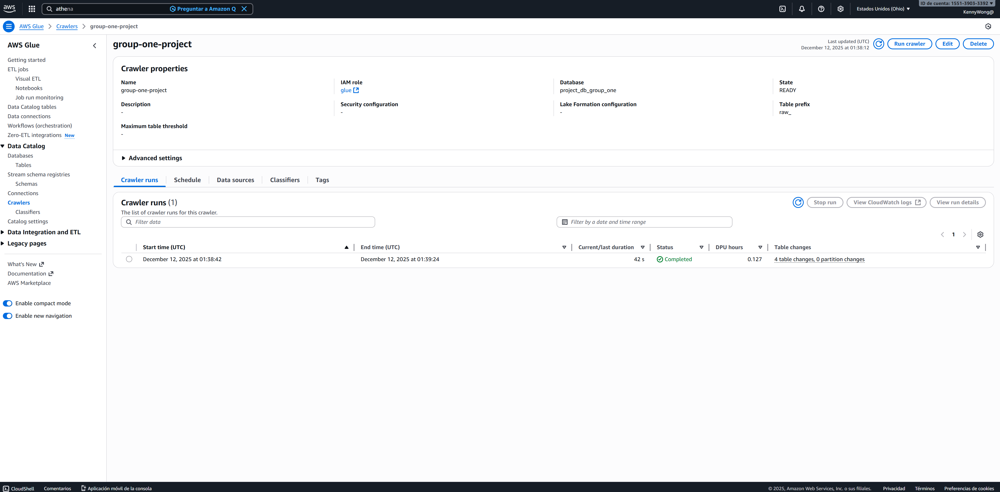
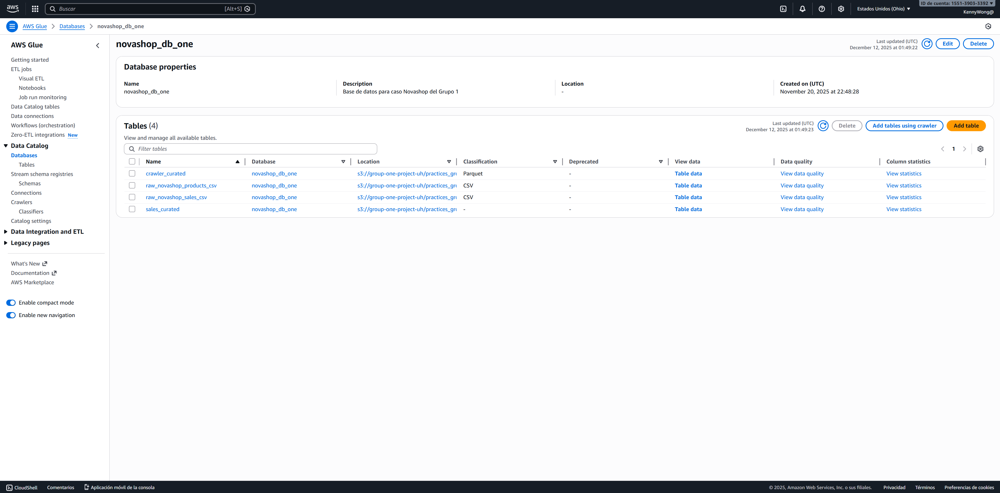
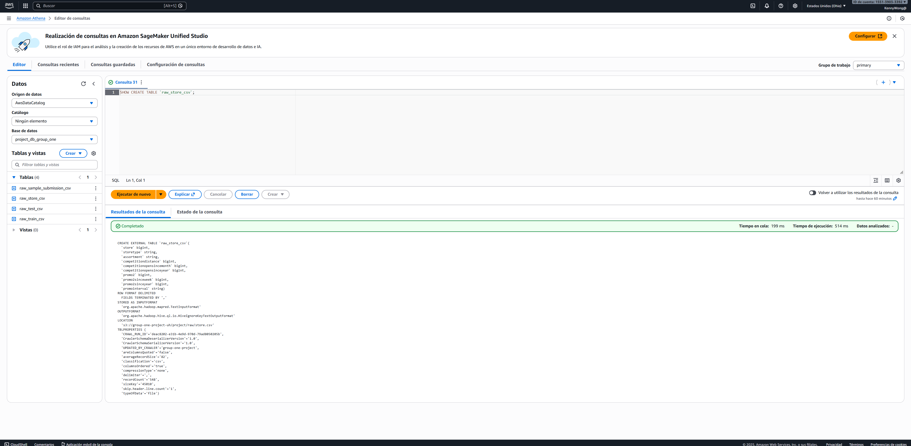

# Proyecto Final - Data Warehouse

## Paso 1: Carga de datos crudos
Carga de data en el S3, a continuación el URI

```bash
s3://group-one-project-uh/project/raw/
```

## Paso 2: Catalogación (Glue Catalog)
Creación de crawlers con el fin de crear los catálogos en glue y tenerlos listos en la database (Glue Catalog) **project_db_group_one**

- Creación del Crawler


- Creación de Base de datos y definición de catalogos (Glue Catalog)


- Validación en Athena


## Paso 3: Preparación de Redshift
Creación de tablas

```sql
CREATE TABLE group_one.project.sample_submission (
    id INT,
    sales INT
)
```

```sql

```

```sql

```

```sql

```