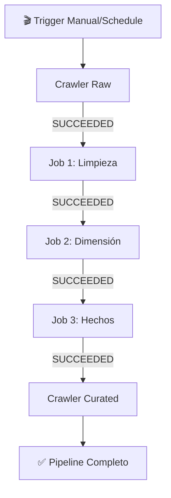
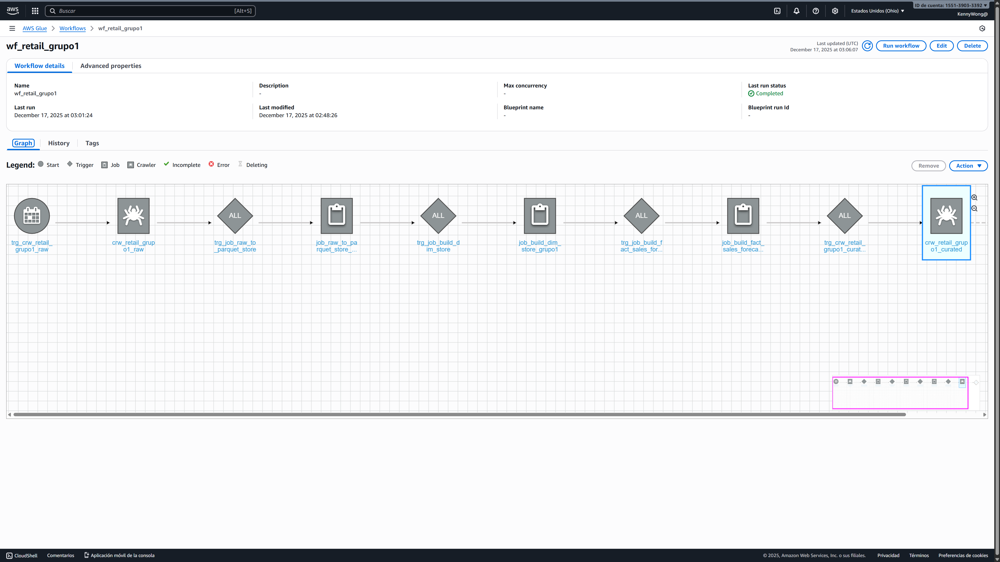

# 🛍️ Proyecto ETL Retail (Rossmann) - Grupo 1

Pipeline de ingeniería de datos implementado en AWS para transformar datos crudos de la cadena de retail Rossmann en un modelo dimensional optimizado para análisis empresarial.

---

## 📋 Tabla de Contenidos

- [Objetivo del Proyecto](#-objetivo-del-proyecto)
- [Arquitectura General](#-arquitectura-general)
- [Estructura de Datos](#-estructura-de-datos)
- [Pipeline ETL](#-pipeline-etl)
- [Orquestación](#-orquestación)
- [Retos y Soluciones](#-retos-y-soluciones)
- [Tecnologías Utilizadas](#-tecnologías-utilizadas)

---

## 🎯 Objetivo del Proyecto

Transformar datos crudos en formato CSV en un modelo dimensional (Star Schema) optimizado en formato Parquet, listo para análisis de negocio y generación de insights sobre ventas y tiendas.

**Flujo de Transformación:**
```
CSV (Raw) → Limpieza → Enriquecimiento → Parquet (Curated) → Analytics
```

---

## 🏗️ Arquitectura General

El proyecto implementa una arquitectura de **Data Lake** basada en AWS con las siguientes capas:

### Componentes AWS

| Servicio | Propósito |
|----------|-----------|
| **Amazon S3** | Almacenamiento de datos (Raw & Curated) |
| **AWS Glue Crawlers** | Descubrimiento automático de esquemas |
| **AWS Glue Data Catalog** | Catálogo centralizado de metadatos |
| **AWS Glue Jobs** | Procesamiento ETL con PySpark |
| **AWS Glue Workflow** | Orquestación de pipeline completo |

### Diagrama de Flujo

```
┌─────────────┐
│   CSV Raw   │
│   (S3 Raw)  │
└──────┬──────┘
       │
       ▼
┌─────────────┐
│  Crawler    │
│   Raw       │
└──────┬──────┘
       │
       ▼
┌─────────────┐       ┌─────────────┐       ┌─────────────┐
│   Job 1:    │─────▶│   Job 2:     │─────▶│   Job 3:    │
│  Limpieza   │       │ Dimensión   │       │   Hechos    │
└──────┬──────┘       └──────┬──────┘       └──────┬──────┘
       │                     │                     │
       └─────────────────────┴─────────────────────┘
                             │
                             ▼
                      ┌─────────────┐
                      │  Crawler    │
                      │  Curated    │
                      └──────┬──────┘
                             │
                             ▼
                      ┌─────────────┐
                      │  Analytics  │
                      │   Ready!    │
                      └─────────────┘
```

---

## 📁 Estructura de Datos

### Bucket S3: `s3://uh-retail-grupo1/`

```
uh-retail-grupo1/
│
├── raw/                              # 📥 Capa de Ingesta (Datos Crudos)
│   ├── store/
│   │   └── store.csv                 # Información maestra de tiendas
│   └── sample_submission/
│       └── sample_submission.csv     # Pronósticos de ventas
│
└── curated/                          # ✨ Capa Procesada (Analytics-Ready)
    ├── store/                        # Tabla intermedia (staging)
    │   └── *.parquet
    ├── dim_store/                    # 🏪 Dimensión de Tiendas
    │   └── *.parquet
    └── fact_sales_forecast/          # 💰 Tabla de Hechos de Ventas
        └── *.parquet
```

### 🔍 Desafío de Diseño Resuelto

**Problema Inicial:** Al cargar todo en una carpeta raíz, el Crawler no podía distinguir esquemas diferentes.

**Solución:** Separación en subcarpetas específicas por fuente de datos, permitiendo inferencia correcta de esquemas.

---

## 🔄 Pipeline ETL

### Fase 1: Catalogación Inicial

#### 🕷️ Crawler Raw: `crw_retail_grupo1_raw`

- **Entrada:** `s3://uh-retail-grupo1/raw/`
- **Función:** Escanea automáticamente los archivos CSV e infiere esquemas
- **Base de Datos:** `retail_grupo1`
- **Tablas Generadas:**
  - `raw_store` - Metadatos de tiendas
  - `raw_sample_submission` - Metadatos de pronósticos

---

### Fase 2: Transformaciones ETL

#### ⚙️ Job 1: `job_raw_to_parquet_store_grupo1`

**Propósito:** Limpieza técnica y estandarización de formato

**Transformaciones Aplicadas:**

| Transformación | Detalle |
|----------------|---------|
| 📝 Renombrado | Columnas a `snake_case` (ej: `StoreType` → `store_type`) |
| 🔢 Casting | Strings → Long/Double según corresponda |
| ❌ Manejo de Nulos | Cadenas vacías `""` → `NULL` usando `pyspark.sql.functions.when` |
| 💾 Formato | CSV → Parquet comprimido |

**Salida:** `s3://uh-retail-grupo1/curated/store/`

**Código Clave:**
```python
df.write.mode("overwrite").parquet("s3://uh-retail-grupo1/curated/store/")
```

---

#### 🏪 Job 2: `job_build_dim_store_grupo1`

**Propósito:** Construcción de dimensión de negocio enriquecida

**Entrada:** Tabla limpia del Job 1

**Columnas Derivadas Creadas:**

| Columna | Descripción | Ejemplo |
|---------|-------------|---------|
| `competition_open_year_month` | Año-mes de apertura competencia | `2015-09` |
| `promo2_start_year_week` | Año-semana inicio promoción | `2015-13` |
| `promo_interval_array` | Meses de promoción como array | `["Jan", "Feb", "Mar"]` |

**Salida:** `s3://uh-retail-grupo1/curated/dim_store/`

---

#### 💰 Job 3: `job_build_fact_sales_forecast_grupo1`

**Propósito:** Generación de tabla de hechos

**Transformaciones:**

- ✏️ Renombrado: `id` → `store_id` (permite JOIN con `dim_store`)
- 🔢 Casting: `sales` a tipo numérico
- 🔗 Preparación de claves foráneas

**Salida:** `s3://uh-retail-grupo1/curated/fact_sales_forecast/`

---

### Fase 3: Catalogación Final

#### 🕷️ Crawler Curated: `crw_retail_grupo1_curated`

- **Entrada:** `s3://uh-retail-grupo1/curated/`
- **Función:** Registra las tablas Parquet procesadas en el catálogo
- **Tablas Finales Disponibles:**
  - ✅ `dim_store` (Dimensión lista para análisis)
  - ✅ `fact_sales_forecast` (Hechos listos para análisis)
  - ✅ `curated_store` (Tabla intermedia - No catalogada en Glue, usada solo como Staging)

---

## 🎭 Orquestación

### Workflow: `wf_retail_grupo1`

Gestiona automáticamente la ejecución secuencial y condicional de todas las tareas.

#### Secuencia de Ejecución



#### Captura con ejecución exitosa



#### Triggers Configurados

| Trigger | Condición | Siguiente Paso |
|---------|-----------|----------------|
| 🚀 Inicial | On Demand/Schedule | Crawler Raw |
| ✅ Trigger 1 | Crawler Raw = SUCCEEDED | Job 1 (Limpieza) |
| ✅ Trigger 2 | Job 1 = SUCCEEDED | Job 2 (Dimensión) |
| ✅ Trigger 3 | Job 2 = SUCCEEDED | Job 3 (Hechos) |
| ✅ Trigger Final | Job 3 = SUCCEEDED | Crawler Curated |

---

## 🚧 Retos y Soluciones

### 1. Idempotencia del Pipeline

#### ❌ Problema
Ejecutar los jobs múltiples veces generaba archivos duplicados en S3 (modo append por defecto), causando duplicación de filas en consultas.

#### ✅ Solución
Implementación explícita del modo `overwrite` en todas las escrituras Spark:

```python
df.write.mode("overwrite").parquet("s3://ruta/destino/")
```

**Beneficio:** Cada ejecución limpia completamente la carpeta destino antes de escribir datos frescos, garantizando idempotencia.

---

### 2. Calidad de Datos (Nulos Inconsistentes)

#### ❌ Problema
El CSV original mezclaba valores `NULL` reales con strings vacíos `""`, dificultando el análisis posterior y la transformación a arrays.

#### ✅ Solución
Estandarización durante el primer Job utilizando lógica condicional:

```python
from pyspark.sql.functions import when, col

df = df.withColumn(
    "promo_interval",
    when(col("promo_interval") == "", None)
    .otherwise(col("promo_interval"))
)
```

**Beneficio:** Datos consistentes que facilitan transformaciones avanzadas (ej: string → array) en jobs posteriores.

---

### 3. Inferencia de Esquemas

#### ❌ Problema
Crawler no distinguía esquemas cuando múltiples archivos CSV estaban en la misma carpeta raíz.

#### ✅ Solución
Reorganización en estructura jerárquica:
```
raw/
├── store/          ← Un esquema específico
└── sample_submission/  ← Otro esquema específico
```

---

## 📈 Análisis de Negocio
Una vez completado el pipeline ETL, los datos procesados están disponibles para responder preguntas estratégicas de negocio mediante consultas SQL en AWS Athena.

1. 🏪 ¿Cuántas tiendas hay por StoreType y Assortment?

```sql
SELECT 
    store_type, 
    assortment, 
    COUNT(store_id) as total_stores
FROM "retail_grupo1"."dim_store"
GROUP BY store_type, assortment
ORDER BY store_type, assortment;
```

2. 🎯 ¿Qué porcentaje de tiendas participa en Promo2?

```sql
SELECT 
    COUNT(store_id) as total_stores,
    SUM(promo2) as stores_with_promo2,
    (CAST(SUM(promo2) AS DOUBLE) / COUNT(store_id)) * 100.0 as pct_participation
FROM "retail_grupo1"."dim_store";
```

3. 📍 ¿Cuál es la distancia promedio a la competencia por StoreType?

```sql
SELECT 
    store_type,
    ROUND(AVG(competition_distance), 2) as avg_distance_meters
FROM "retail_grupo1"."dim_store"
WHERE competition_distance IS NOT NULL
GROUP BY store_type
ORDER BY avg_distance_meters ASC;
```

4. ⚠️ ¿Qué tiendas enfrentan mayor presión competitiva?

```sql
SELECT 
    store_id, 
    store_type, 
    competition_distance
FROM "retail_grupo1"."dim_store"
WHERE competition_distance IS NOT NULL 
  AND competition_distance > 0
ORDER BY competition_distance ASC
LIMIT 20;
```

5. 📅 ¿Cómo se distribuyen las aperturas de competencia por año?

```sql
SELECT 
    competition_open_since_year, 
    COUNT(store_id) as new_competitors_count
FROM "retail_grupo1"."dim_store"
WHERE competition_open_since_year IS NOT NULL
GROUP BY competition_open_since_year
ORDER BY competition_open_since_year DESC;
```

6. 🔄 ¿Qué patrones existen en Promo2 (Meses de renovación)?

```sql
SELECT 
    promo_month, 
    COUNT(*) as frequency
FROM "retail_grupo1"."dim_store"
CROSS JOIN UNNEST(promo_interval_array) AS t(promo_month)
GROUP BY promo_month
ORDER BY frequency DESC;
```

7. 💰 ¿Cuál es el total de ventas pronosticadas?

```sql
SELECT 
    SUM(sales) as total_forecasted_sales
FROM "retail_grupo1"."fact_sales_forecast";
```

8. 📊 ¿Cómo se distribuyen las ventas (outliers)?

```sql
SELECT 
    MIN(sales) as min_sales,
    approx_percentile(sales, 0.25) as p25,
    approx_percentile(sales, 0.50) as median_p50,
    approx_percentile(sales, 0.75) as p75,
    approx_percentile(sales, 0.95) as p95_outlier_threshold,
    MAX(sales) as max_sales
FROM "retail_grupo1"."fact_sales_forecast";
```

9. 💡 ¿Qué decisiones de negocio se podrían tomar con este análisis?

---

## 🛠️ Tecnologías Utilizadas

| Tecnología | Versión/Tipo | Uso |
|------------|--------------|-----|
| **AWS S3** | Object Storage | Data Lake (Raw & Curated) |
| **AWS Glue** | Serverless | ETL, Catalogación, Orquestación |
| **PySpark** | 3.x | Procesamiento distribuido |
| **Athena** | Presto-based | Motor de consultas SQL serverless |
| **Parquet** | Columnar | Formato optimizado para analytics |
| **Python** | 3.x | Scripting de transformaciones |

---

## 📊 Modelo Dimensional Resultante

### Star Schema

```
        ┌─────────────────────────────┐
        │  dim_store                  │
        ├─────────────────────────────┤
        │ store_id (PK)               │
        │ store_type                  │
        │ assortment                  │
        │ competition_*               │
        │ promo2_*                    │
        │ promo_interval_*            │
        │ competition_open_year_month │
        │ promo2_start_year_week      │
        │ promo_interval_array        │
        └─────────┬───────────────────┘
                  │
                  │ 1
                  │
                  │ N
         ┌────────┴────────┐
         │ fact_sales_     │
         │    forecast     │
         ├─────────────────┤
         │ store_id (FK)   │
         │ sales           │
         └─────────────────┘
```

---

## 🎉 Resultado Final

✅ Pipeline automatizado end-to-end  
✅ Datos limpios y estandarizados  
✅ Modelo dimensional optimizado  
✅ Formato Parquet para consultas rápidas  
✅ Idempotencia garantizada  
✅ Calidad de datos mejorada  

**¡Los datos están listos para análisis de negocio y generación de insights!**

---

## 👥 Equipo

**Grupo 1** - Proyecto ETL Retail Rossmann

---

## 📝 Licencia

Este proyecto es parte de un ejercicio académico.